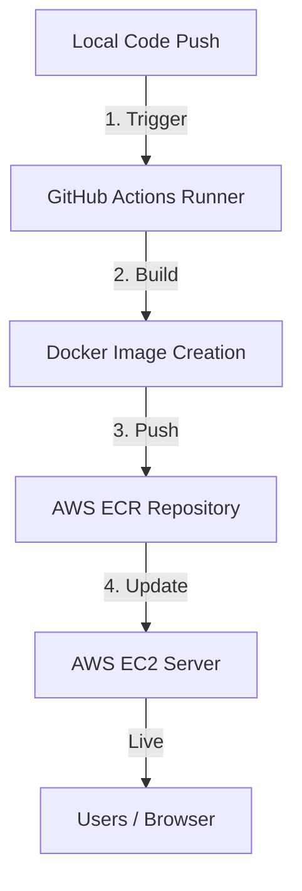

# Low Level Design (LLD) - EnergyMind DevOps

This document provides a detailed technical explanation of the core components used in the project deployment, based on the fundamental pillars of our DevOps architecture.

---

## 1. Code (Application Layer)
The application is built using a modern Python stack, split into two primary layers:
- **Backend (FastAPI):** Handles the core logic, API endpoints, and integration with AI models. It uses `research_chain.py` to orchestrate searches and AI responses.
- **Frontend (Streamlit):** Provides an interactive web interface for users to chat with the AI and view energy insights.
- **Integration:** The code communicates with external APIs (Groq for LLM and Tavily for search) using environment variables for security.

## 2. AWS Server (Infrastructure Layer)
The application is hosted on **Amazon Web Services (AWS)**:
- **Instance Type:** Amazon Elastic Compute Cloud (EC2) running **Amazon Linux 2023**.
- **Security Groups:** Configured as a virtual firewall to control traffic.
    - **Port 7860:** Open for the Streamlit web interface.
    - **Port 8000:** Open for the FastAPI backend.
    - **Port 22:** Open for SSH access (management).
- **Role:** The server acts as the "Host" that runs the Docker engine to manage our application execution.

## 3. Dockerfile (Configuration Layer)
The `Dockerfile` is a text document that contains all the commands a user could call on the command line to assemble an image.
- **Base Image:** Uses `python:3.10-slim` for a lightweight and secure foundation.
- **Dependencies:** Installs necessary system libraries and Python packages listed in `requirements.txt`.
- **Startup Script:** Uses `start.sh` to launch both the FastAPI and Streamlit services concurrently within the same environment.

## 4. Docker Image (Template Layer)
A Docker image is a read-only template with instructions for creating a Docker container.
- **Build Process:** Automated via **GitHub Actions** (CI/CD). Every code "push" triggers a new build.
- **Storage:** The built image is stored in **AWS ECR (Elastic Container Registry)**.
- **Tagging:** Images are tagged with `latest` and a unique `Git-SHA` for version control and easy rollback.

## 5. Docker Container (Execution Layer)
A container is a runnable instance of an image.
- **Execution:** The container is pulled from AWS ECR and run on the EC2 instance using the `docker run` command.
- **Isolation:** It ensures that the application runs in its own sandbox, independent of the host OS configuration.
- **Port Mapping:** Maps the internal container ports (7860 & 8000) to the EC2 instance's public IP, making the app reachable via the browser.

---

## 6. CI/CD Pipeline Flow (Automation)
The project uses an automated assembly line for deployments:

### Automation Steps:
1. **Trigger (Push to Main):** A `git push` signal starts the GitHub Actions workflow.
2. **Build (GitHub Runner):** A virtual Ubuntu machine checks out the code, configures AWS, and builds the Docker image.
3. **Push (AWS ECR):** The built image is tagged as `latest` and stored in the Amazon Elastic Container Registry.
4. **Deploy (AWS EC2):** The EC2 server pulls the updated image from ECR and restarts the container for live updates.

---
**Summary:** The code is packed into a **Dockerfile**, built into a **Docker Image**, stored in **AWS ECR**, and finally executed as a **Docker Container** on an **AWS Server**.
